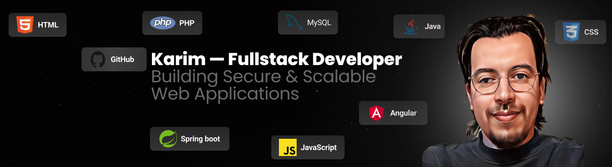

<!-- ================= Banner ================= -->

  

<!-- ================= Social ================= -->

  
  

  

<h2>👋 Hi, I'm Karim</h2>

Full Stack Developer focused on building secure and maintainable web applications.

I design structured REST APIs using **Java & Spring Boot** and build dynamic front-end applications with **Angular**.

I value clean architecture, security, and long-term maintainability.

- 🔐 Focus: **Spring Boot / Spring Security / JWT / Clean Architecture**
- 🧪 Testing: **JUnit / Mockito / MockMvc**
- 🚀 Exploring: **DevOps / Docker / scalable architectures**

---

## 🧰 Tech Stack

  

---

## 🚀 Featured Projects

### 🔹 LesBonsServices
Appointment management platform connecting clients and professionals.  
**Highlights:** JWT authentication, role-based access, validation, global exception handling, unit testing, clean layered architecture.

### 🔹 Formatech
Educational management backend.  
**Highlights:** JPA relationships, DTO mapping, database persistence, structured architecture.

---

  
📊 <b>GitHub Stats</b>

   

  

    
  

  

    
  

  <i>"Clean code today prevents problems tomorrow."</i>

